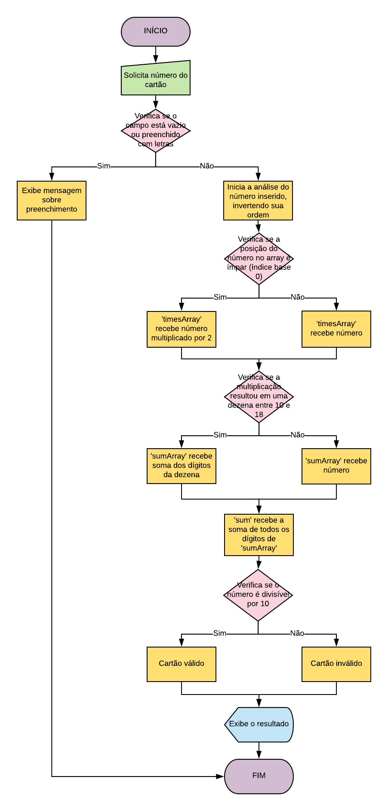

# Cartão de crédito

## Motivation
This was the final product of the first sprint of Laboratoria bootcamp. The challenge was to create a platform to verify if a credit card is valid using Luhn's algorithm. It was also necessary to describe the entire process in the lines bellow.

## Descrição
Inicialmente, é pedido que o usuário insira o número de um cartão de crédito. Caso o campo correspondente seja vazio ou preenchido com letras, obtem-se a mensagem "Você precisa digitar um número". Do contrário, iniciam-se os processos e testes referentes ao algoritmo de Luhn.
São eles:
1. Inverter o número do cartão, através de métodos combinados - 'string.split().reverse().join()' - inserindo o resultado dentro de uma variável chamada 'cardReverse';
2. Multiplicar os números localizados em posições ímpares - considerando o index baseado em 0 - por dois, guardando-os, ao final, em um array denominado 'timesArray';
3. Verificar se alguma dessas multiplicações resultou em um número de dois dígitos, entre 10 e 18 e, caso essa condição tenha ocorrido, fazer a soma dos dígitos - para isso foi usado o princípio de subtrair nove das dezenas, que é o equivalente a somar seus dígitos. O resultado foi atribuído à variável 'sumArray';
4. Ao final a variável 'sum' recebeu a soma de todos os dígitos da sequência e foi executada a seguinte condição: caso o número seja divisível por dez, o cartão é válido e a mensagem positiva é exposta na tela, caso contrário, o usuário recebe a mensagem informando que o cartão é inválido.

## Fluxograma
